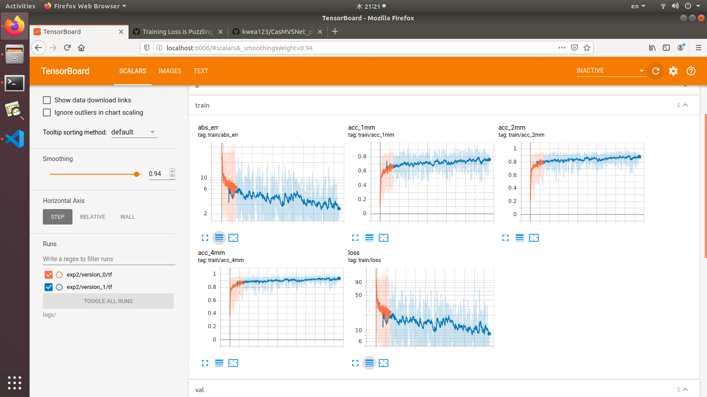
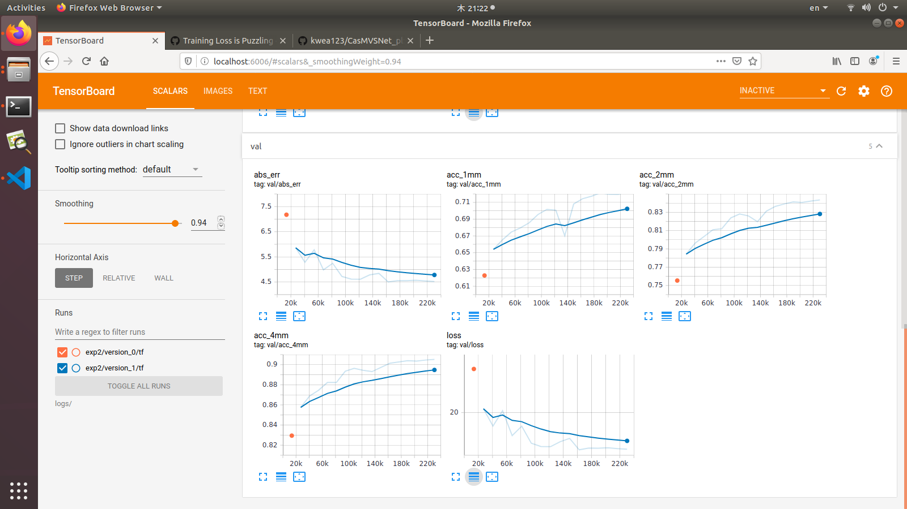

# CasMVSNet_pl
Unofficial implementation of [Cascade Cost Volume for High-Resolution Multi-View Stereo and Stereo Matching](https://arxiv.org/pdf/1912.06378.pdf) using [pytorch-lightning](https://github.com/PyTorchLightning/pytorch-lightning)

Official implementation: [CasMVSNet](https://github.com/alibaba/cascade-stereo/tree/master/CasMVSNet)

Reference MVSNet implementation: [MVSNet_pl](https://github.com/kwea123/MVSNet_pl)

### Update

1.  Implement groupwise correlation in [Learning Inverse Depth Regression for Multi-View Stereowith Correlation Cost Volume](https://arxiv.org/abs/1912.11746). It achieves almost the same result as original variance-based cost volume, but with fewer parameters and consumes lower memory, so it is highly recommended to use (in contrast, the inverse depth sampling in that paper turns out to have no effect in my experiments, maybe because DTU is indoor dataset, and inverse depth improves outdoor dataset better). To activate, set `--num_groups 8` in training.
2.  2020/03/06: Add [Tanks and temples](https://www.tanksandtemples.org/) [evaluation](evaluations/tanks)!
3.  2020/03/07: Add [BlendedMVS](https://github.com/YoYo000/BlendedMVS) [evaluation](evaluations/blendedmvs)!
4.  2020/03/31: Add [BlendedMVS](https://github.com/YoYo000/BlendedMVS) [training](#blendedmvs)!
5.  2020/04/30: Add point cloud to mesh [guideline](#point-cloud-to-mesh)!

# Installation

## Hardware

* OS: Ubuntu 16.04 or 18.04
* NVIDIA GPU with **CUDA>=10.0** (tested with 1 RTX 2080Ti)

## Software

* Python==3.7 (installation via [anaconda](https://www.anaconda.com/distribution/) is recommended, use `conda create -n casmvsnet_pl python=3.7` to create a conda environment and activate it by `conda activate casmvsnet_pl`)
* Python libraries
    * Install core requirements by `pip install -r requirements.txt`
    * Install [Inplace-ABN](https://github.com/mapillary/inplace_abn) by `pip install inplace-abn`

# Training

Please see each subsection for training on different datasets.
Available training datasets:
*  [DTU dataset](#dtu-dataset)
*  [BlendedMVS](#blendedmvs)

## DTU dataset

### Data download

Download the preprocessed [DTU training data](https://drive.google.com/file/d/1eDjh-_bxKKnEuz5h-HXS7EDJn59clx6V/view) and [Depth_raw](https://virutalbuy-public.oss-cn-hangzhou.aliyuncs.com/share/cascade-stereo/CasMVSNet/dtu_data/dtu_train_hr/Depths_raw.zip) from original [MVSNet repo](https://github.com/YoYo000/MVSNet) and unzip. For the description of how the data is created, please refer to the original paper.

### Training model

Run (example)
```
python train.py \
   --dataset_name dtu \
   --root_dir $DTU_DIR \
   --num_epochs 16 --batch_size 2 \
   --depth_interval 2.65 --n_depths 8 32 48 --interval_ratios 1.0 2.0 4.0 \
   --optimizer adam --lr 1e-3 --lr_scheduler cosine \
   --exp_name exp
```

Note that the model consumes huge GPU memory, so the batch size is generally small.

See [opt.py](opt.py) for all configurations.

### Example training log



### Metrics
The metrics are collected on the DTU val set.

|           | resolution | n_views | abs_err | acc_1mm  | acc_2mm   | acc_4mm    | GPU mem in GB <br> (train*/val) |
| :---:     |  :---:     | :---:   | :---:   |  :---:   | :---:     | :---:      | :---:   |
| Paper     |  1152x864  | 5       | N/A     | N/A      | 82.6%     | 88.8%      | 10.0 / 5.3 |
| This repo <br> (same as paper) |  640x512   | 3       | 4.524mm | 72.33%  | 84.35%     | 90.52%     | 8.5 / 2.1 |
| This repo <br> (gwc**) |  640x512  | 3       | **4.242mm**| **73.99%** | **85.85%** | **91.57%**    | **6.5 / 2.1** |

*Training memory is measured on `batch size=2` and `resolution=640x512`.

**Gwc with `num_groups=8` with parameters `--depth_interval 2.0 --interval_ratios 1.0 2.5 5.5 --num_epochs 50`, see [update](#update) 1. This implementation aims at maintaining the concept of cascade cost volume, and build new operations to further increase the accuracy or to decrease inference time/GPU memory.

### Pretrained model and log
Download the pretrained model and training log in [release](https://github.com/kwea123/CasMVSNet_pl/releases).
The above metrics of `This repo (same as paper)` correspond to this training but the model is saved on the 10th epoch (least `val_loss` but not the best in other metrics).

------------------------------------------------------------------------------------------------------------------------

## BlendedMVS

Run
```
python train.py \
   --dataset_name blendedmvs \
   --root_dir $BLENDEDMVS_LOW_RES_DIR \
   --num_epochs 16 --batch_size 2 \
   --depth_interval 192.0 --n_depths 8 32 48 --interval_ratios 1.0 2.0 4.0 \
   --optimizer adam --lr 1e-3 --lr_scheduler cosine \
   --exp_name exp
```
The `--depth_interval 192.0` is the product of the coarsest `n_depth` and the coarsest `--interval_ratio`: `192.0=48x4.0`.

### Some modifications w.r.t original paper

Since BlendedMVS contains outdoor and indoor scenes with a large variety of depth ranges (some from 0.1 to 2 and some from 10 to 200, notice that these numbers are not absolute distance in mm, they're in some unknown units), it is difficult to evaluate the absolute accuracy (e.g. an error of 2 might be good for scenes with depth range 10 to 200, but terrible for scenes with depth range 0.1 to 2). Therefore, I decide to scale the depth ranges roughly to the same scale (about 100 to 1000). It is done [here](https://github.com/kwea123/CasMVSNet_pl/blob/cc483ce7e421329e163f965af809f62e5b0d5a35/datasets/blendedmvs.py#L98-L103). In that way, the depth ranges of **all scenes** in BlendedMVS are scaled to approximately the same as DTU (425 to 935), so we can continue to use the same metrics (acc_1mm, etc) to evaluate predicted depth maps.

Another advantage of the above scaling trick is that when applying model pretrained on DTU to BlendedMVS, we can get better results since their depth range is now roughly the same; if we do without scaling, the model will yield very bad result if the original depth range is for example 0.1 to 2.

### Pretrained model and log
Download the pretrained model and training log in [release](https://github.com/kwea123/CasMVSNet_pl/releases).

------------------------------------------------------------------------------------------------------------------------

## Some code tricks

Since MVS models consumes a lot of GPU memory, it is indispensable to do some code tricks to reduce GPU memory consumption. I tried the followings:
*  Replace `BatchNorm+Relu` with [Inplace-ABN](https://github.com/mapillary/inplace_abn): Reduce the memory by ~15%!
*  `del` the tensor when it is never accessed later: Only helps a little.
*  Use `a = a+b` in training and `a += b` in testing: Reduce about 300MB (don't know the reason..)

# Testing

For depth prediction example, see [test.ipynb](test.ipynb).

For point cloud fusion from depth prediction, please go to [evaluations](evaluations/) to see the general depth fusion method description, then go to dataset subdirectories for detailed results (qualitative and quantitative).

A video showing the point cloud for scan9 in DTU in different angles and [me](https://github.com/kwea123/VTuber_Unity) (click to link to YouTube):
[](https://youtu.be/wCjMoBR9Nh0)

## Point cloud to mesh

You can follow [this great post](https://towardsdatascience.com/5-step-guide-to-generate-3d-meshes-from-point-clouds-with-python-36bad397d8ba) to convert the point cloud into mesh file. **Poisson’ reconstruction** turns out to be a good choice. Here's what I get after tuning some parameters (the parameters should be scene-dependent, so you need to experiment by yourself): 
