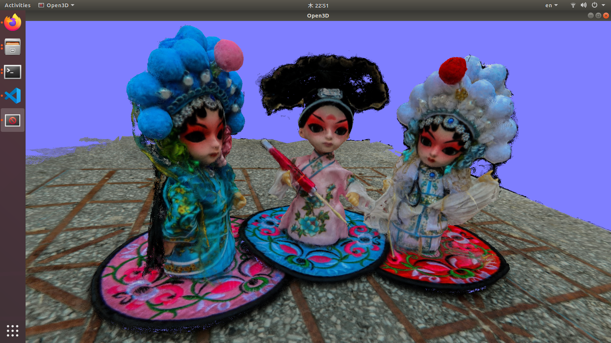
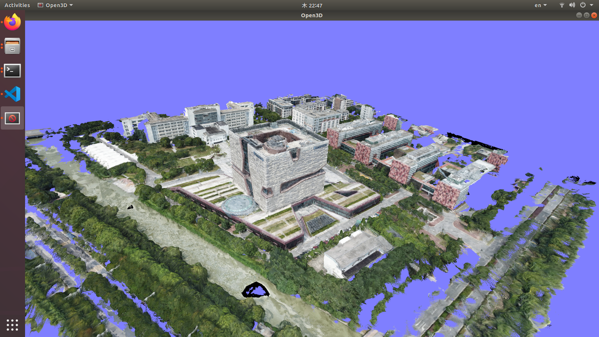
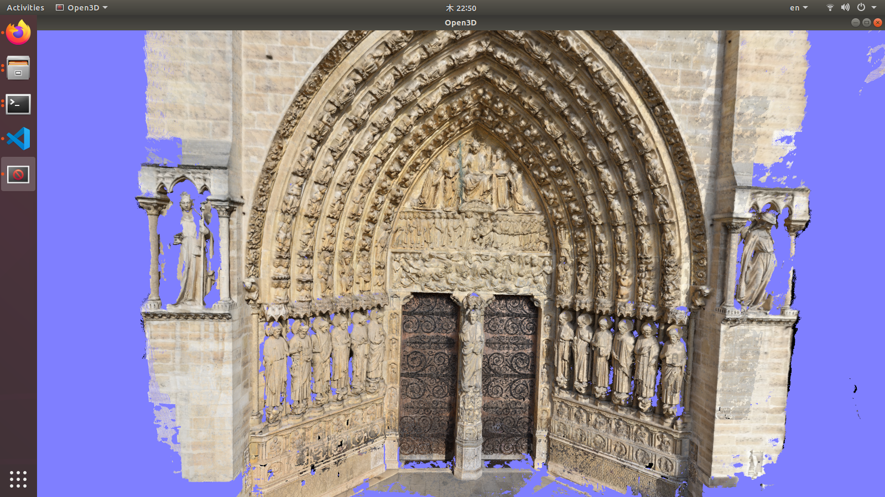

# Model

You can use either blendedmvs-trained dataset or use dtu-trained model. They are provided in [release](https://github.com/kwea123/CasMVSNet_pl/releases)

## Some notes
During evaluation, since some scenes have more than 800 views, you might need limit the number of refernce views by setting `--max_ref_views` to a proper number (400 by default) as the program requires huge RAM which grows with the image size and the number of reference views. I tested with 32GB RAM, and it is almost all consumed using default settings, if you have more RAM, feel free to set this number (and the image size) larger.

# Quantitative evaluation

[No point cloud evaluation currently](https://github.com/YoYo000/BlendedMVS/issues/4).

# Qualitative evaluation

Please see [BlendedMVS_scenes](https://github.com/kwea123/BlendedMVS_scenes) for a quick lookup of various scenes.

Point clouds are provided in [release](https://github.com/kwea123/CasMVSNet_pl/releases).

Some examples:

### 5a618c72784780334bc1972d

### 5b558a928bbfb62204e77ba2

### 57f8d9bbe73f6760f10e916a

I'm very impressed by this scene. The unevenness of the sculpture is reconstructed to a degree that it looks almost like if it were carved by a veteran artist's hand.

A [youtube video](https://youtu.be/-54sf5aVt4Y) showing the point cloud in interactive view.
