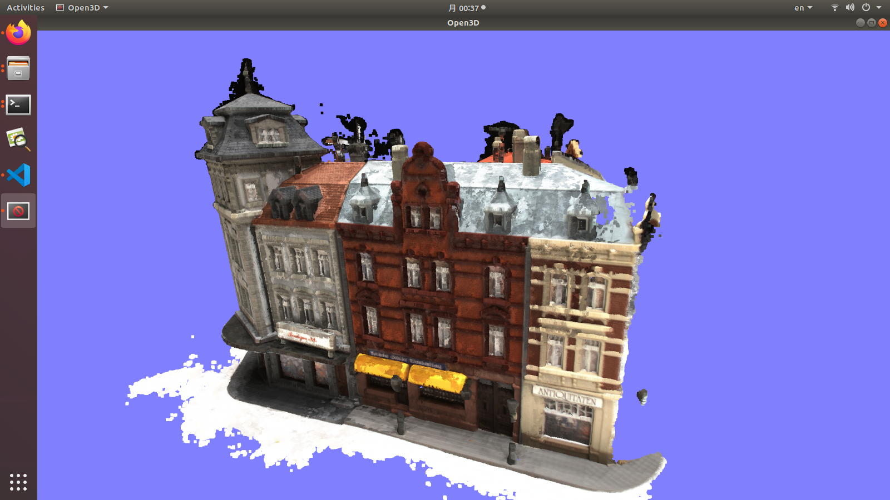
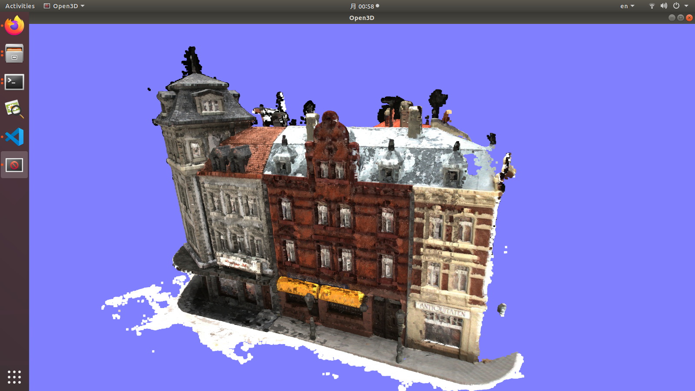
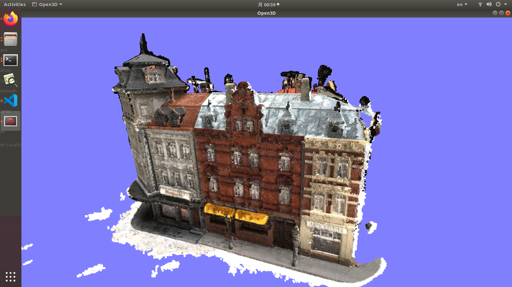
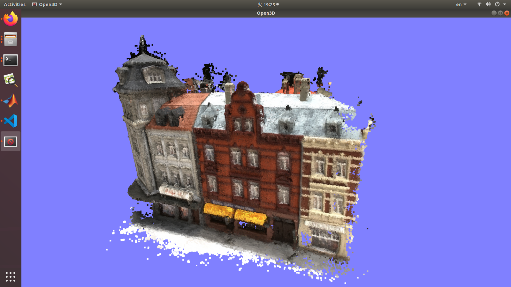

This folder contains the minimum necessary scripts for running DTU evaluation. You can download the full code [here](http://roboimagedata2.compute.dtu.dk/data/MVS/SampleSet.zip).

We assume that you have run the [depth fusion](../), and have the final `.ply` files for each scan.

# Installation

You need to have `Matlab`. It is a **must**, you cannot use workaround free software like `octave`, I tried but some libraries are not available (e.g. `KDTreeSearch`)

# Data download

1.  Download [Points](http://roboimagedata2.compute.dtu.dk/data/MVS/Points.zip) and [SampleSet](http://roboimagedata2.compute.dtu.dk/data/MVS/SampleSet.zip).
2.  Extract the files and arrange in the following structure:
```
├── DTU (can be anywhere)
│   ├── Points
│   └── ObsMask
```
Where the `ObsMask` folder is taken from `SampleSet/MVS Data`.

# Quantitative evaluation

1.  Change `dataPath`, `plyPath`, `resultsPath` [here](https://github.com/kwea123/CasMVSNet_pl/blob/784cec6635fa819bab0d716c15ba07972c260293/evaluations/dtu/BaseEvalMain_web.m#L8-L10). Be careful that you need to ensure `resultsPath` folder already exists because `Matlab` won't automatically create...
2.  Open `Matlab` and run `BaseEvalMain_web.m`. It will compute the metrics for each scan specified [here](https://github.com/kwea123/CasMVSNet_pl/blob/master/evaluations/dtu/BaseEvalMain_web.m#L23). This step will take **A VERY LONG TIME**: for the point cloud I provide, each of them takes **~20mins** to evaluate... the time depends on the point cloud size.
3.  Set `resultsPath` [here](https://github.com/kwea123/CasMVSNet_pl/blob/master/evaluations/dtu/ComputeStat_web.m#L10) the same as above, then run `ComputeStat_web.m`, it will compute the average metrics of all scans. The final numbers `mean acc` and `mean comp` are the final result, and `overall` is just the average of these two numbers. You can then compare these numbers with papers/other implementations.

## Result
Since it takes a long time to evaluate (5 hours using default settings...), I provide the numbers here for comparison with some open source methods:

|   | Acc. | Comp. | Overall | resolution |
| --- | --- | --- | --- | --- |
| [MVSNet](https://github.com/YoYo000/MVSNet) | 0.396 | 0.527 | 0.462 | 1600x1184 |
| [MVSNet_pytorch](https://github.com/xy-guo/MVSNet_pytorch) | 0.4492 | 0.3796 | 0.4144 | 1600x1184 |
| *[MVSNet_pytorch](https://github.com/xy-guo/MVSNet_pytorch) | 0.5229 | 0.4514 | 0.4871 | 1152x864 |
| *[R-MVSNet](https://github.com/YoYo000/MVSNet) | 0.383 | 0.452 | 0.4175 | 1600x1184 |
| CasMVSNet paper (fusibile) | 0.325 | 0.385 | 0.355 | 1152x864 |
| *[CasMVSNet](https://github.com/alibaba/cascade-stereo/tree/master/CasMVSNet) | 0.3779 | 0.3645 | 0.3712 | 1152x864 |
| PointMVSNet paper | 0.361 | 0.421 | 0.391 | 1280x960 |
| *[PointMVSNet](https://github.com/callmeray/PointMVSNet) | 0.6344 | 0.6481 | 0.6412 | 1280x960 |
| [UCSNet](https://github.com/touristCheng/UCSNet) paper | 0.330 | 0.372 | 0.351 | 1600x1184 |
| [PVAMVSNet](https://github.com/yhw-yhw/PVAMVSNet) paper | 0.372 | 0.350 | 0.361 | 1600x1184 |
| *This repo | 0.3653 | 0.3664 | 0.3658 | 1152x864 |

1. The number of views used is 5 for all methods.
2. *Methods' metrics are verified by me using their pretrained model, or the point cloud directly for R-MVSNet.
3. Generally, larger resolution leads to better result.

# Qualitative evaluation

This part is just visualization of the point cloud, you can do without above quantitative evaluation.

## Demo for scan9
I provide the fusion result for **all 119 scans** with the default parameters in `eval.py` in [release](https://github.com/kwea123/CasMVSNet_pl/releases/). Download and put them under `results/dtu/points`. A sample viewpoint (put under `results/dtu/`) `viewpoint.json` is also provided: add `--use_viewpoint` to use the same viewpoint to do comparison between scans/different fusion approaches! You can also save your own viewpoint by `--save_viewpoint`.

The default viewpoint looks like:


Comparison between some open source methods:
<p align="center">
  
  
  <br>
  
  
  <br>
  <sup>Top left: 
     <a href="https://github.com/alibaba/cascade-stereo/tree/master/CasMVSNet">Original casmvsnet</a> Top right: <a href="https://github.com/YoYo000/MVSNet">R-MVSNet</a> Bottom left: <a href="https://github.com/callmeray/PointMVSNet">PointMVSNet</a> Bottom right: This repo
  </sup>
</p>
